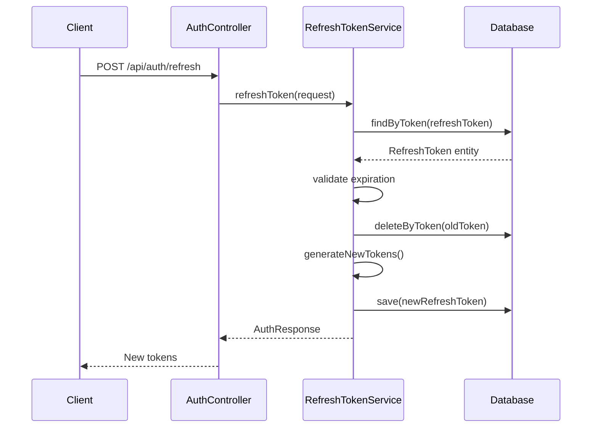

# Auth Service - Clean Architecture Implementation

A Spring Boot microservice for authentication and authorization built following Clean Architecture principles, implementing the Hexagonal Architecture pattern with proper dependency inversion and JWT token management.

## 📋 Table of Contents

- [Architecture Overview](#architecture-overview)
- [Project Structure](#project-structure)
- [Clean Architecture Layers](#clean-architecture-layers)
- [Key Features](#key-features)
- [Technologies Used](#technologies-used)
- [Getting Started](#getting-started)
- [API Documentation](#api-documentation)
- [Testing Strategy](#testing-strategy)
- [JWT Implementation](#jwt-implementation)
- [Database Integration](#database-integration)
- [Production Readiness](#production-readiness)

## 🏗️ Architecture Overview

This project implements Clean Architecture with Hexagonal Architecture pattern, following these core principles:

- **Dependency Inversion**: Inner layers define interfaces (ports), outer layers implement them (adapters)
- **Separation of Concerns**: Each layer has a single responsibility
- **Framework Independence**: Business logic is isolated from frameworks
- **Port-Adapter Pattern**: Clear separation between domain and infrastructure
- **Testability**: Easy to unit test with proper mocking
- **JWT Security**: Stateless authentication with access and refresh tokens

### Architecture Diagram

```
┌─────────────────────────────────────────────────────────────┐
│                    Controllers                              │
│              (HTTP/REST API Interface)                      │
│         AuthController (Login/Refresh/Logout)               │
└─────────────────────┬───────────────────────────────────────┘
                      │
┌─────────────────────▼───────────────────────────────────────┐
│                  Application                                │
│          (Use Cases & Business Rules)                       │
│    AuthenticateUser │ RefreshToken │ LogoutUser             │
└─────────────────────┬───────────────────────────────────────┘
                      │
┌─────────────────────▼───────────────────────────────────────┐
│                    Domain                                   │
│              (Entities & Business Logic)                    │
│                User │ RefreshToken                          │
└─────────────────────┬───────────────────────────────────────┘
                      │
┌─────────────────────▼───────────────────────────────────────┐
│                Infrastructure                               │
│         (MySQL, JPA, Adapters, Mappers)                    │
│    UserRepositoryAdapter │ RefreshTokenRepositoryAdapter    │
│    JwtTokenAdapter │ PasswordEncoderAdapter                 │
└─────────────────────────────────────────────────────────────┘
```

## 📁 Project Structure

```
src/main/kotlin/com/loc/auth_service/
├── domain/                          # Enterprise Business Rules
│   └── model/
│       ├── User.kt                 # User Domain Entity
│       └── RefreshToken.kt         # RefreshToken Domain Entity
│
├── application/                     # Application Business Rules
│   ├── service/
│   │   ├── AuthenticateUserService.kt    # Authentication Use Case
│   │   ├── RefreshTokenService.kt        # Token Refresh Use Case
│   │   └── LogoutUserService.kt          # Logout Use Case
│   └── port/
│       ├── UserRepositoryPort.kt         # User Repository Contract
│       ├── RefreshTokenRepositoryPort.kt # RefreshToken Repository Contract
│       ├── JwtTokenPort.kt              # JWT Token Contract
│       └── PasswordEncoderPort.kt       # Password Encoder Contract
│
├── infrastructure/                  # Frameworks & Drivers
│   ├── adapter/
│   │   ├── UserRepositoryAdapter.kt     # User Repository Implementation
│   │   ├── RefreshTokenRepositoryAdapter.kt # RefreshToken Repository Implementation
│   │   ├── JwtTokenAdapter.kt           # JWT Token Implementation
│   │   └── PasswordEncoderAdapter.kt    # Password Encoder Implementation
│   ├── entity/
│   │   ├── UserEntity.kt               # JPA User Entity
│   │   └── RefreshTokenEntity.kt       # JPA RefreshToken Entity
│   ├── repository/
│   │   ├── UserJpaRepository.kt        # JPA User Repository
│   │   └── RefreshTokenJpaRepository.kt # JPA RefreshToken Repository
│   ├── mapper/
│   │   ├── UserEntityMapper.kt         # User Domain ↔ Entity Mapping
│   │   └── RefreshTokenEntityMapper.kt # RefreshToken Domain ↔ Entity Mapping
│   ├── config/
│   │   ├── SecurityConfig.kt           # Spring Security Configuration
│   │   └── DataSeeder.kt               # Initial Data Seeding
│   └── exception/
│       └── GlobalExceptionHandler.kt   # Global Exception Handling
│
├── controller/                      # Interface Adapters
│   └── AuthController.kt           # REST Authentication Controller
│
└── AuthServiceApplication.kt       # Spring Boot Main Application
```

## 🎯 Clean Architecture Layers

### 1. Domain Layer (Innermost)
- **Purpose**: Contains enterprise business rules and entities
- **Dependencies**: None (pure business logic)
- **Components**:
  - `User`: Core domain entity with username, password, email, role
  - `RefreshToken`: Domain entity for token management with expiration logic
  - Business rules for user validation and token expiration

### 2. Application Layer
- **Purpose**: Contains application-specific business rules (use cases)
- **Dependencies**: Only depends on Domain layer
- **Components**:
  - `AuthenticateUserService`: Handles user authentication and token generation
  - `RefreshTokenService`: Handles token refresh and rotation
  - `LogoutUserService`: Handles user logout and token revocation
  - **Ports**: Define contracts for external dependencies

### 3. Infrastructure Layer (Outermost)
- **Purpose**: Contains frameworks, databases, external services
- **Dependencies**: Implements interfaces from inner layers
- **Components**:
  - **Adapters**: Implement domain contracts (ports)
  - **Entities**: JPA entities for database persistence
  - **Repositories**: Spring Data JPA repositories
  - **Mappers**: Convert between domain and persistence models
  - **Configuration**: Spring Security, JWT, and database setup

### 4. Controller Layer (Interface Adapters)
- **Purpose**: Handles HTTP requests and responses
- **Dependencies**: Uses Application layer services
- **Components**:
  - `AuthController`: REST API endpoints for authentication

## ✨ Key Features

- **Clean Architecture Implementation**: Proper dependency inversion and layer separation
- **JWT Authentication**: Stateless authentication with access and refresh tokens
- **Hexagonal Architecture**: Ports and Adapters pattern implementation
- **MySQL Integration**: Relational database with Spring Data JPA
- **Liquibase Migration**: Database schema versioning and migration
- **Spring Security**: Comprehensive security configuration
- **OpenAPI Integration**: Auto-generated API documentation
- **Production Ready**: Health checks, metrics, and monitoring endpoints
- **Data Seeding**: Automatic creation of admin and user accounts
- **Global Exception Handling**: Centralized error handling

## 🛠️ Technologies Used

- **Framework**: Spring Boot 3.5.3
- **Language**: Kotlin 1.9.25
- **Database**: MySQL 8.3.0
- **Security**: Spring Security 6.x
- **JWT**: JJWT 0.12.3
- **ORM**: Spring Data JPA with Hibernate
- **Migration**: Liquibase
- **Documentation**: OpenAPI 3.0 Generator
- **Testing**: JUnit 5, MockK, TestContainers
- **Build Tool**: Gradle with Kotlin DSL
- **Runtime**: Java 17
- **Monitoring**: Spring Boot Actuator with Prometheus

## 🚀 Getting Started

### Prerequisites

- JDK 17 or higher
- Docker and Docker Compose
- Gradle 7.x or higher

### Running the Application

1. **Start MySQL Database**:
   ```bash
   cd server
   docker-compose up -d
   ```

2. **Run Database Migrations** (if enabled):
   ```bash
   ./gradlew liquibaseUpdate
   ```

3. **Run the Application**:
   ```bash
   ./gradlew bootRun
   ```

4. **Access the API**:
   - Application: http://localhost:8084
   - Health Check: http://localhost:8084/actuator/health
   - Metrics: http://localhost:8084/actuator/metrics
   - Prometheus: http://localhost:8084/actuator/prometheus
   - API Docs: http://localhost:8084/v3/api-docs

### Configuration

The application uses `application.yaml` for configuration:

```yaml
# Server Configuration
server:
  port: 8084

# Database Configuration
spring:
  datasource:
    url: jdbc:mysql://localhost:3308/auth_service
    username: root
    password: mysql

# JWT Configuration
jwt:
  secret: MA9TFJ2cV/PxU1h68mbsq/vZB0LskxuAtsQFyZdrmBCNuGk+1pVS6YFIrQEEmnVV
  expiration: 86400000    # 24 hours
  refresh-expiration: 604800000  # 7 days
```

### Default Users

The application automatically creates default users on startup:

- **Admin User**: `admin` / `admin123`
- **Regular User**: `user` / `user123`

## 📚 API Documentation

### Authentication Endpoints

| Method | Endpoint | Description |
|--------|----------|-------------|
| POST | `/api/auth/login` | User authentication |
| POST | `/api/auth/refresh` | Refresh access token |
| POST | `/api/auth/logout` | Logout user (revoke refresh token) |
| POST | `/api/auth/logout-all` | Logout from all devices |

### Request/Response Examples

**Login**:
```json
POST /api/auth/login
Content-Type: application/json

{
  "username": "admin",
  "password": "admin123"
}
```

**Response**:
```json
{
  "success": true,
  "message": "Login successful",
  "data": {
    "accessToken": "eyJhbGciOiJIUzI1NiIsInR5cCI6IkpXVCJ9...",
    "refreshToken": "eyJhbGciOiJIUzI1NiIsInR5cCI6IkpXVCJ9...",
    "tokenType": "Bearer",
    "expiresIn": 86400,
    "username": "admin",
    "role": "ADMIN"
  },
  "timestamp": 1703123456789
}
```

**Refresh Token**:
```json
POST /api/auth/refresh
Content-Type: application/json

{
  "refreshToken": "eyJhbGciOiJIUzI1NiIsInR5cCI6IkpXVCJ9..."
}
```

**Logout**:
```json
POST /api/auth/logout
Content-Type: application/json

{
  "refreshToken": "eyJhbGciOiJIUzI1NiIsInR5cCI6IkpXVCJ9..."
}
```

## 🧪 Testing Strategy

### Test Structure Following Clean Architecture

```
src/test/kotlin/com/loc/auth_service/
├── application/service/
│   ├── AuthenticateUserServiceTest.kt     # Authentication Use Case Tests
│   ├── RefreshTokenServiceTest.kt         # Token Refresh Use Case Tests
│   └── LogoutUserServiceTest.kt           # Logout Use Case Tests
├── controller/
│   └── AuthControllerTest.kt              # API Integration Tests
├── infrastructure/
│   ├── adapter/
│   │   ├── UserRepositoryAdapterTest.kt   # User Repository Tests
│   │   ├── RefreshTokenRepositoryAdapterTest.kt # RefreshToken Repository Tests
│   │   ├── JwtTokenAdapterTest.kt         # JWT Token Tests
│   │   └── PasswordEncoderAdapterTest.kt  # Password Encoder Tests
│   ├── mapper/
│   │   ├── UserEntityMapperTest.kt        # User Entity Mapping Tests
│   │   └── RefreshTokenEntityMapperTest.kt # RefreshToken Entity Mapping Tests
│   └── repository/
│       ├── UserJpaRepositoryTest.kt       # JPA User Repository Tests
│       └── RefreshTokenJpaRepositoryTest.kt # JPA RefreshToken Repository Tests
└── domain/
    └── model/
        ├── UserTest.kt                    # User Domain Tests
        └── RefreshTokenTest.kt            # RefreshToken Domain Tests
```

### Running Tests

```bash
# Run all tests
./gradlew test

# Run specific test categories
./gradlew test --tests "*Controller*"
./gradlew test --tests "*Service*"
./gradlew test --tests "*Repository*"

# Run with coverage
./gradlew test jacocoTestReport
```

### Test Technologies

- **Unit Tests**: MockK for mocking dependencies
- **Integration Tests**: TestContainers for MySQL integration
- **Web Layer Tests**: @WebMvcTest with SpringMockK
- **Repository Tests**: @DataJpaTest with embedded H2
- **Security Tests**: @WithMockUser for authentication testing

## 🔐 JWT Implementation

### JWT Token Structure

**Access Token Payload**:
```json
{
  "sub": "admin",
  "role": "ADMIN",
  "email": "admin@example.com",
  "userId": 1,
  "iat": 1703123456,
  "exp": 1703209856
}
```

**Refresh Token Payload**:
```json
{
  "sub": "admin",
  "role": "ADMIN",
  "email": "admin@example.com",
  "userId": 1,
  "iat": 1703123456,
  "exp": 1703728256
}
```

### Token Management

- **Access Token**: 24 hours expiration
- **Refresh Token**: 7 days expiration
- **Token Rotation**: New refresh token generated on each refresh
- **Token Revocation**: Refresh tokens stored in database for revocation
- **Security**: HMAC SHA-256 signing with strong secret key

### JWT Service Implementation

```kotlin
@Component
class JwtTokenAdapter : JwtTokenPort {
    
    override fun generateAccessToken(user: User): String {
        return buildToken(user, jwtExpiration)
    }
    
    override fun generateRefreshToken(user: User): String {
        return buildToken(user, refreshExpiration)
    }
    
    override fun isTokenValid(token: String, user: User): Boolean {
        val username = extractUsername(token)
        return (username == user.username) && !isTokenExpired(token)
    }
    
    private fun buildToken(user: User, expiration: Long): String {
        val claims = mapOf(
            "role" to user.role,
            "email" to user.email,
            "userId" to user.id
        )
        
        return Jwts.builder()
            .claims(claims)
            .subject(user.username)
            .issuedAt(Date())
            .expiration(Date(System.currentTimeMillis() + expiration))
            .signWith(getSignInKey())
            .compact()
    }
}
```

## 🗄️ Database Integration

### Database Schema

**Users Table**:
```sql
CREATE TABLE users (
    id BIGINT AUTO_INCREMENT PRIMARY KEY,
    username VARCHAR(255) UNIQUE NOT NULL,
    password VARCHAR(255) NOT NULL,
    email VARCHAR(255) NOT NULL,
    role VARCHAR(50) NOT NULL DEFAULT 'USER',
    enabled BOOLEAN NOT NULL DEFAULT TRUE,
    account_non_expired BOOLEAN NOT NULL DEFAULT TRUE,
    account_non_locked BOOLEAN NOT NULL DEFAULT TRUE,
    credentials_non_expired BOOLEAN NOT NULL DEFAULT TRUE,
    created_at TIMESTAMP DEFAULT CURRENT_TIMESTAMP,
    updated_at TIMESTAMP DEFAULT CURRENT_TIMESTAMP ON UPDATE CURRENT_TIMESTAMP
);
```

**Refresh Tokens Table**:
```sql
CREATE TABLE refresh_tokens (
    id BIGINT AUTO_INCREMENT PRIMARY KEY,
    token VARCHAR(512) UNIQUE NOT NULL,
    user_id BIGINT NOT NULL,
    expiry_date TIMESTAMP NOT NULL,
    created_at TIMESTAMP DEFAULT CURRENT_TIMESTAMP,
    is_revoked BOOLEAN NOT NULL DEFAULT FALSE,
    FOREIGN KEY (user_id) REFERENCES users(id) ON DELETE CASCADE
);
```

### Repository Pattern Implementation

```kotlin
// Port (Interface)
interface UserRepositoryPort {
    fun findByUsername(username: String): User?
    fun findById(id: Long): User?
    fun save(user: User): User
}

// Adapter (Implementation)
@Component
class UserRepositoryAdapter(
    private val userJpaRepository: UserJpaRepository,
    private val userEntityMapper: UserEntityMapper
) : UserRepositoryPort {
    
    override fun findByUsername(username: String): User? {
        return userJpaRepository.findByUsername(username)
            ?.let { userEntityMapper.toDomain(it) }
    }
    
    override fun save(user: User): User {
        val entity = userEntityMapper.toEntity(user)
        val savedEntity = userJpaRepository.save(entity)
        return userEntityMapper.toDomain(savedEntity)
    }
}
```

## 🏭 Production Readiness

### Health Checks and Monitoring

- **Health Check**: `/actuator/health` - Application and database health
- **Readiness Probe**: `/actuator/health/readiness` - Kubernetes readiness
- **Liveness Probe**: `/actuator/health/liveness` - Kubernetes liveness
- **Metrics**: `/actuator/metrics` - Application metrics
- **Prometheus**: `/actuator/prometheus` - Prometheus metrics format

### Security Features

- **Password Hashing**: BCrypt with configurable strength
- **JWT Security**: Strong secret key with HMAC SHA-256
- **CSRF Protection**: Disabled for stateless API
- **CORS Configuration**: Configurable cross-origin requests
- **Rate Limiting**: Ready for implementation
- **Input Validation**: Bean validation on all endpoints

### Observability

- **Structured Logging**: JSON format for log aggregation
- **Distributed Tracing**: Ready for Zipkin/Jaeger integration
- **Metrics Collection**: Micrometer with Prometheus export
- **Error Tracking**: Global exception handling with proper logging

### Configuration Management

- **Environment Variables**: 12-factor app configuration
- **Profile-based Configuration**: Development, staging, production
- **Secret Management**: External configuration for sensitive data
- **Database Migration**: Liquibase for schema versioning

## 🏆 Clean Architecture Benefits Achieved

1. **Independence**: Business logic is independent of frameworks, UI, and external agencies
2. **Testability**: Easy to test business rules without external dependencies
3. **Flexibility**: Easy to change frameworks, databases, or external services
4. **Maintainability**: Clear separation of concerns makes the code easier to understand
5. **Scalability**: Architecture supports scaling individual components
6. **Security**: Proper authentication and authorization implementation
7. **Type Safety**: Kotlin's type system prevents common runtime errors
8. **Production Ready**: Comprehensive monitoring and observability

## 📊 Architecture Validation

The project validates Clean Architecture principles through:

- **Dependency Rule**: Dependencies point inward only
- **Port-Adapter Pattern**: Clear interfaces between layers
- **Domain Isolation**: Pure business logic without framework dependencies
- **Comprehensive Testing**: Each layer tested independently
- **Framework Independence**: Business logic can be tested without Spring Boot
- **Security Integration**: Authentication logic properly separated from infrastructure

This implementation demonstrates how Clean Architecture principles can be effectively applied to a Spring Boot authentication microservice, resulting in a maintainable, testable, secure, and scalable codebase that follows industry best practices for authentication and authorization systems.

## 🔄 Token Refresh Flow



## 📈 Performance Considerations

- **Database Indexing**: Proper indexes on username and token fields
- **Connection Pooling**: HikariCP for optimal database connections
- **Token Caching**: Redis integration ready for token validation caching
- **Async Processing**: Ready for async token cleanup jobs
- **Load Balancing**: Stateless design supports horizontal scaling 